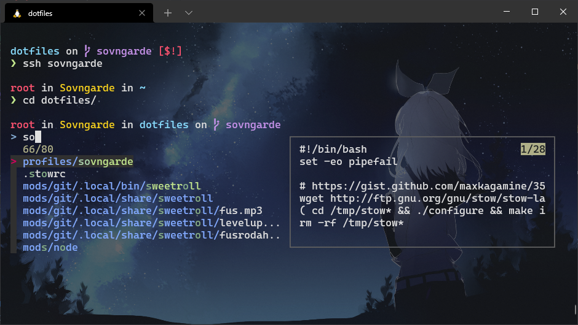
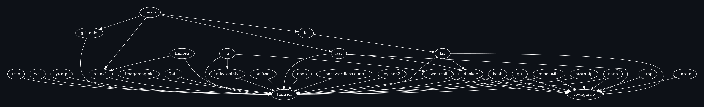
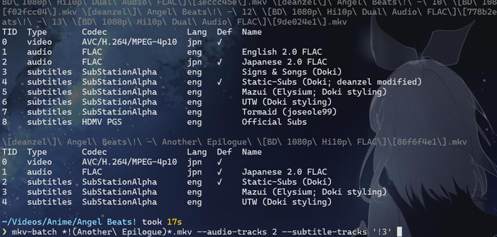

# maxkagamine's dotfiles

<p align="center"></p>

**[ bash](#-bash)**
&nbsp;|&nbsp;
**[ git](#-git)**
&nbsp;|&nbsp;
**[ wsl](#-wsl)**
&nbsp;|&nbsp;
**[ unraid](#-unraid)**
&nbsp;|&nbsp;
**[ mkvtoolnix](#-mkvtoolnix)**
&nbsp;|
**[⚙&hairsp;misc utils](#misc-utils)**
&nbsp;|&nbsp;
**[ sweetroll](#-sweetroll)**
&nbsp;|&nbsp;
[more&hellip;](#fzf)

Behold, [GNU Stow][stow]: the mod manager for your Linux home directory! Anyone who's used Vortex or MO2 to mod games like [Skyrim][skyrim] will find this familiar: mod (dot) files are organized into separate folders, and the mod manager (stow) combines them into the game (home) directory using symlinks.

As Stow doesn't ([yet][stow todo]) support pre/post-install hooks, I'm emulating it by placing Makefiles in the mod directories and including them from [the main Makefile](Makefile). This keeps mods self-contained with any needed package install steps etc., and also allows mods to _depend on other mods_, with Make automatically figuring out which mods need to be installed and in what order:



Best part about this setup is it doesn't require any dotfile-specific frameworks or YAML files. Just run `make`.

Notable mods (headers link to the relevant file/directory):

##  [bash](mods/bash)

Applies the convention of loading configuration files from a directory to bashrc: after setting some common aliases and such, sources every file in **~/.config/bashrc.d/**. This way the other mods can put their stuff in e.g. bashrc.d/git.sh rather than one big file as is traditional. (The system-wide /etc/profile already does this with /etc/profile.d/*.)

> (Psst: if you want to change your ls colors, [my file](mods/bash/.config/dircolors) might be an easier starting-off point than `--print-database`. I spent the time formatting it so you don't have to.)

##  [git](mods/git)

[Git aliases](mods/git/.config/bashrc.d/git.sh) and [aliases](mods/git/.config/git/config) (including my favorite: the alias alias, `git alias`) + the "gg" function I use so much [I wrote an article about it][gg-faster-git-commits], and of course what would be a _Max Kagamine_ system without a myriad of [Skyrim references][fus-ro-dah] (brace yourself).

Oh and _[empty string is git status](mods/git/.config/bashrc.d/zz_empty_string_is_git_status.sh):_

> <i><ruby>Mukashi mukashi <rp>(</rp><rt>Once upon a time</rt><rp>)</rp>...</i>  
> “`git status` is too long,” Max thought as he sat at his desk.  
> So with the magic of `git config --global`, it became `git s`.  
> ...But that was too long.  
> So he aliased it to `gs` in his bashrc; just two letters, see?  
> But these two, too, were too long!  
> So he dropped the 's', just `g`, now, short as can be.  
> But even one letter 'twas one letter too long!  
> And so it became, the shortest `git status` of all:  
> **Empty string!**

True story. This is a trick I learned a long time ago: using `PROMPT_COMMAND` (or a [precmd hook][bash-preexec]) to compare the last history entry to that which was seen the previous time the prompt was shown, as hitting enter at an empty prompt will run the prompt command again, but the last history number will be the same. Side effect is hitting <kbd>Ctrl+C</kbd> (but not <kbd>Ctrl+U</kbd> or <kbd>Alt+Shift+#</kbd>) at a prompt will trigger git status, too.

Also, check out [**git-branch-fzf**](mods/git/.local/bin/git-branch-fzf), my awesome [fzf]-powered interactive branch switcher with keyboard shortcuts to toggle remote branches, delete branches (including remote and even the current branch!), and to [fetch the latest](mods/git/.local/bin/git-checkout-latest) of a branch **before** switching.

## &hairsp; [wsl](mods/wsl)

For "Tamriel," my main machine running the [Windows Subsystem for Linux][wsl], because I can't computer without a command line but also can't not Windows.

[This Alt+V keybind to paste Windows paths as Linux paths](mods/wsl/.config/bashrc.d/wsl.sh) should be useful to any WSL users. `unclip` is an alias for `xsel -bo`. I've created [a WSL version of xsel in Rust](https://github.com/maxkagamine/wsl-tools) that lets commands which aren't WSL-aware copy things to the Windows clipboard (faster and less janky / proper Unicode handling compared to PowerShell-based approaches).

I've also found it helpful to [define a command_not_found_handle](mods/bash/.bashrc) so that I can run Windows exe's without the .exe extension. (Note the `complete -I` below it, which overrides bash's default command tab completion to remove the unnecessary ".exe". Both of these also check in node modules, so I can run npm package commands without having to prefix them with "npx".)

<details open>
<summary><h3>Using Yubikey for GPG & SSH in WSL</h3></summary>

In the past, I was using [wsl2-ssh-pageant](https://github.com/BlackReloaded/wsl2-ssh-pageant) which uses `socat` to replace the gpg-agent socket with one that runs an exe that bridges Gpg4win. The bridge itself worked well (with a [small fix](https://github.com/maxkagamine/dotfiles/commit/fddf1ee8def1667b04f465f5a52e7a6f4c73bc30)), but despite [my best efforts](https://github.com/maxkagamine/dotfiles/commit/2f61b2820019fc591b33a2d6a47dcb6622cf1eee) I could never get the socket shenanigans to work reliably.

In the end that was too much of a hassle, so I switched to using [usbipd-win](https://github.com/dorssel/usbipd-win) which connects the Yubikey directly to Linux. This has proved to be much simpler. The downside is that connecting a device to WSL means disconnecting it from Windows; if you need the Yubikey to log into a website, you'll have to temporarily detach it from WSL. (I defined [aliases](mods/wsl/.config/bashrc.d/wsl.sh) to make this easy.)

1. Open a terminal as admin
2. `winget.exe install --exact dorssel.usbipd-win`
3. Once installed, restart the terminal (as admin again), then run `usbipd.exe list` and note the Yubikey's VID:PID (should say "Smartcard Reader")
4. Bind the device using `usbipd.exe bind --hardware-id <VID:PID>`. You only have to do this once per device.
5. Attach it to WSL using `usbipd.exe attach -wi <VID:PID>`. The Yubikey should show up now if you run `lsusb` in WSL. (Arch users: `sudo pacman -S usbutils`)
   - _Note: If in the future you ever get an error saying your kernel doesn't support USBIP and to run `wsl --update`, but you already ran `wsl --update`, try running the winget command to update usbipd-win instead. I've only had this happen once and it was due to a major version upgrade._
7. Ubuntu users: `sudo apt install scdaemon` (Arch users can skip this, as it's included in the gnupg package.)
8. If you run `gpg --card-status` now in WSL, it'll give you an error that says "gpg: selecting card failed: No such device" unless you run gpg as root. This has to do with the permissions of the usb device in /dev. There are two ways to fix this:
   - What was working for me until I tried upgrading to Ubuntu 24.04 ("noble") was to install `pcscd` in addition to `scdaemon`. This is a separate daemon that handles communication with smartcards. Ubuntu 24.04 however introduced some kind of security policy change that broke it. Incidentally, this was the final straw that got me to finally switch to Arch, so unfortunately I don't have a solution. It might work for you, but I suggest trying the below first; you may not need pcscd at all:
   - _**Preferred way:**_ Add a udev rule to fix the device permissions:
     1. `sudo nano /usr/lib/udev/rules.d/yubikey.rules` and add the following:
        ```
        SUBSYSTEM=="usb", ATTR{idVendor}=="*", ATTR{idProduct}=="*", MODE="666"
        ```
        Some notes:
        - This will simply make all USB devices accessible to all users, which for WSL purposes is fine.
        - The _correct way_, it seems, is to [apply the `uaccess` tag as shown here](https://wiki.archlinux.org/title/Udev#Allowing_regular_users_to_use_devices) and let systemd handle permissions instead.
        - Originally I was assigning my own user and group to the device with `SUBSYSTEM=="usb", ATTR{idVendor}=="1050", ATTR{idProduct}=="0406", MODE="666", OWNER="max", GROUP="max"`, but this stopped working after a system update. Running `udevadm test $(udevadm info --query=path --name=/dev/usb/hiddev0)` revealed an error "User 'max' is not a system user, ignoring."
          - Removing the `OWNER` and using `GROUP="wheel"` _did_ work (as `wheel` is a "system group," of which my user is a member), so that's another option if you want it to be a bit more restricted but the `uaccess` approach doesn't work for you (set `MODE="660"` in that case).
        - If you want to dig into the udev syntax, see [Writing udev rules](https://reactivated.net/writing_udev_rules.html) and [udev(7)](https://man7.org/linux/man-pages/man7/udev.7.html).
        - You can see the device's permissions with `ls -l /dev/bus/usb/$(lsusb | perl -ne '/Bus (\d+) Device (\d+).*Yubikey/ && printf "$1/$2"')`.
     3. Detach the Yubikey from WSL and re-attach it.
     4. `gpg --card-status` should work without root now.
9. Set `SSH_AUTH_SOCK` and `GPG_TTY` in your .bashrc [as shown here](mods/gpg/.config/bashrc.d/gpg.sh).
10. Add `enable-ssh-support` to [~/.gnupg/gpg-agent.conf](mods/gpg/.gnupg/gpg-agent.conf)
11. Add `Match host * exec "gpg-connect-agent updatestartuptty /bye"` to [~/.ssh/config](mods/gpg/.ssh/config)
    - Explanation for why `updatestartuptty` is necessary [here](https://stackoverflow.com/a/72427213); running it via ssh config comes from [this answer](https://unix.stackexchange.com/a/587691). Supposedly `GPG_TTY` is enough, but for whatever reason on my machine that only worked for gpg signing and not the ssh agent ¯\\\_(ツ)\_/¯
    - Note: Without a GUI pinentry program, some Git features in VSCode (like auto-fetch) won't work until you've unlocked the card in a terminal (e.g. by running `git fetch` yourself).
      - I ended up pulling out the Windows build of pinentry-qt5 from Gpg4win so that it can be used standalone from WSL with the Linux version of gpg; see [commit 0a5abfc](https://github.com/maxkagamine/dotfiles/commit/0a5abfc234302e36f1e683bed7ed60716cc74681).
12. Assuming you've added your GPG key as an SSH key in GitHub (`gpg --export-ssh-key <key id>`), `ssh git@github.com` should work now!
    - If when trying to export the SSH public key for a newly-generated key you get an error saying it's invalid, make sure you've added an authentication subkey.
    - If you get an "error in libcrypto," you may need to run [the command shown here](https://security.stackexchange.com/questions/276688/now-that-sshcontrol-has-been-deprecated-how-to-use-gpg-key-for-ssh-authentica#:~:text=Get%20the%20keygrip,ssh%3A%20true%27%20/bye) to tell gpg to use the key for SSH.

</details>

<details open>
<summary><h3>Setting up Arch in WSL</h3></summary>

**Update:** Arch is [now officially supported](https://antiz.fr/blog/archlinux-official-wsl-image/), so some or all of the first 5 steps (depending on how they set it up) may be different/unnecessary. Notes:

- The official Arch install disables color & progress bars in pacman. Uncomment "Color" and comment "NoProgressBar" in /etc/pacman.conf.

---

1. [Download the ArchWSL zip](https://github.com/yuk7/ArchWSL/releases/latest), extract to %localappdata%\Arch (or wherever), and run the exe
2. Set the root password, create your own user, add it to the wheel group, and set its password:
   ```
   # passwd
   # useradd -m -G wheel -s /bin/bash max
   # passwd max
   ```
   Fun fact: I looked up the origin of the "wheel" name. It comes from "big wheel" which is an older way of saying "head honcho." According to Ngram the phrase had a surgence in popularity in the late 40s through the 50s. So the term "wheel" is basically 1960s-programmer slang for "Administrator." The more you know!
3. `EDITOR=nano visudo` and uncomment the %wheel line towards the bottom to allow admins to sudo.
   - The reason we're not adding a sudoers.d file here like the ArchWSL setup guide suggests is we want to be able to override this with our own sudoers file, but they're evaluated in lexicographical order and we don't want a file starting with "w" overriding us. Sudoers files should also always be edited using visudo.
4. Exit out of WSL and `Arch.exe config --default-user max`.
5. Initialize the pacman keyring (this is the last step from the setup guide; everything after this is custom):
   ```
   $ sudo pacman-key --init
   $ sudo pacman-key --populate
   $ sudo pacman -Sy archlinux-keyring
   $ sudo pacman -Su
   ```
6. Consider changing the default pacman mirror: https://archlinux.org/mirrorlist/ or [rate-mirrors](https://github.com/westandskif/rate-mirrors) (this helped with the timeout issue & slow download speed I was experiencing).
7. Fix the Yubikey's device permissions so GPG can access it without root ([explained above](#using-yubikey-for-gpg--ssh-in-wsl)):
   ```
   $ sudo pacman -S usbutils # Installs lsusb
   $ lsusb # Confirm yubikey's vendor & product numbers
   $ sudo nano /lib/udev/rules.d/yubikey.rules
   SUBSYSTEM=="usb", ATTR{idVendor}=="*", ATTR{idProduct}=="*", MODE="666"
   $ gpg --card-status # Should work now without root after detaching & re-attaching the Yubikey
   ```
8. Import public keys:
   ```
   $ curl https://github.com/maxkagamine.gpg | gpg --import -
   $ curl https://github.com/web-flow.gpg | gpg --import -
   ```
   One-liner to set the trust for all keys to "ultimate":
   ```
   $ gpg --list-keys --fingerprint --keyid-format long | sed -En '/fingerprint/{s/.*=|\s+//g;s/$/:6:/;p}' | gpg --import-ownertrust
   ```
9. Install the bare minimum needed packages:
   ```
   $ sudo pacman -S base-devel git
   ```
10. Clone using HTTP first, since we need the dotfiles to set up GPG as the SSH agent:
    ```
    $ mkdir Projects && cd Projects
    $ git clone https://github.com/maxkagamine/dotfiles.git
    $ cd dotfiles
    $ rm ~/.bash_profile ~/.bashrc
    $ make
    ```
11. Check that SSH works now, and then switch the repo to SSH:
    ```
    $ . ~/.bashrc  # No .r alias yet
    $ gpg-connect-agent reloadagent /bye
    $ ssh git@github.com
    $ git remote set-url origin git@github.com:maxkagamine/dotfiles.git
    ```
12. Hooray!

</details>

## &hairsp; [unraid](mods/unraid)

For "Sovngarde," my NAS. There isn't much in this mod (just a `CDPATH` and a function to list/monitor files on the array that are being accessed), but if you're
running Unraid as well, see **[How to install GNU Stow on Unraid]**. Here's my user script, set to run on array start, if it happens to be useful:

<details>
<summary><code>cat /boot/config/plugins/user.scripts/scripts/install_dotfiles/script</code></summary>

```sh
#!/bin/bash
#name=Install dotfiles
#description=&lpar;Re&rpar;clone & install dotfiles.
#argumentDescription=Branch
#argumentDefault=master
#clearLog=true
set -eo pipefail

export PATH="/usr/local/bin:$PATH"
export HOME=/root

DOTFILES_DIR=~/dotfiles
BRANCH=${1:-master}

# Nuke existing dotfiles
rm -rfv ~/.bashrc ~/.bash_profile "$DOTFILES_DIR"

# Clean up symlinks
find ~ -xtype l -exec rm -v -- {} +
find ~ -depth -type d -empty -exec rmdir -v -- {} \;

# Clone repo
git clone -b "$BRANCH" https://github.com/maxkagamine/dotfiles.git "$DOTFILES_DIR"

# Install
cd "$DOTFILES_DIR"
make
```

</details>

Also take a look at:

- [User script to create backups of the flash drive and appdata on a schedule][backup_flash_and_appdata.sh]
- [Guide to running nginx on Unraid with a wildcard cert, using the official nginx and certbot Docker images][Nginx & certbot on Unraid]

##  [mkvtoolnix](mods/mkvtoolnix)

Tools for batch remuxing MKVs using mkvtoolnix: [**mkv-ls**](mods/mkvtoolnix/.local/bin/mkv-ls) shows tracks in a table similar to the GUI but groups identical track listings for batch processing with [**mkv-batch**](mods/mkvtoolnix/.local/bin/mkv-batch).
  
For example, if I wanted to keep only the Japanese audio and remove the Signs & Songs tracks from everything except the "Another Epilogue" special (which `mkv-ls` shows has different tracks):
  


_(The escaped filenames in gray are for copy/pasting into the `mkv-batch` command, but for screenshot purposes I used the `!()` glob syntax instead.)_

Additional tools:

- [**mkv-cat**](mods/mkvtoolnix/.local/bin/mkv-cat) — Concatenates the input MKVs, adding chapters for each file.
- [**mkv-extract-subs**](mods/mkvtoolnix/.local/bin/mkv-extract-subs) — Batch extracts all subtitles from the given MKVs.
- [**mkv-extract-fonts**](mods/mkvtoolnix/.local/bin/mkv-extract-fonts) — Batch extracts all unique fonts (by filename) from the given MKVs.
- [**mkv-rm-cover**](mods/mkvtoolnix/.local/bin/mkv-rm-cover) — Removes all image/jpeg and image/png attachments from the given MKVs.
- [**mkv-clean**](mods/mkvtoolnix/.local/bin/mkv-clean) — Removes the title and video track name (both used occasionally just to advertise the encoding group), cover image (some groups plaster the series cover on every episode), and common Windows system fonts (which are often unnecessarily included with subs and do nothing but waste space) from the given MKVs.
- [**ass-ls-fonts**](mods/mkvtoolnix/.local/bin/ass-ls-fonts) — Lists all unique fonts referenced in the subs via either `Style:` or `\fn`.
- [**ass-to-txt**](mods/mkvtoolnix/.local/bin/ass-to-txt) — Strips out everything but the dialogue to make diffing subtitles easier.

## ⚙&hairsp;[misc utils](mods/misc-utils/.local/bin)

Miscellaneous utilities:

- [**append-crc**](mods/misc-utils/.local/bin/append-crc) — Adds (or updates) a file's crc32 hash to its filename.
- [**batch-rename**](mods/misc-utils/.local/bin/batch-rename) — Helper for quickly applying a perl substitution to filenames.
- [**flatten**](mods/misc-utils/.local/bin/flatten) — Flattens the contents of a directory such that "foo/bar/file.jpg" is renamed to "foo - bar - file.jpg", with an optional prefix/suffix added to the filenames.
- [**intersect-csvs**](mods/misc-utils/.local/bin/intersect-csvs) — Creates CSVs containing only rows that exist in two or more of the given CSVs. For example, given A.csv, B.csv, and C.csv, creates A+B.csv, A+C.csv, B+C.csv, and A+B+C.csv. I used this to create [a map](https://www.google.com/maps/d/viewer?mid=1kaE2O2LTjoS5Bf2YUCQ6OFJlXuert8U) of arcades in Tokyo that have my favorite games.
- [**mkanimedir**](mods/misc-utils/.local/bin/mkanimedir) — Turns a MAL link and a bunch of episodes into a nice folder.
- [**mkmoviedir**](mods/misc-utils/.local/bin/mkmoviedir) — Like mkanimedir but for an IMDb link.
- [**title-case**](mods/misc-utils/.local/bin/title-case) — Converts text to properly-capitalized title case.
- [**ubo-sort**](mods/misc-utils/.local/bin/ubo-sort) — Organizes uBlock Origin filter lists.
- [**upscale**](mods/misc-utils/.local/bin/upscale) — Wrapper for several AI image upscalers, with options for automatic batch processing.
- [**weigh**](mods/misc-utils/.local/bin/weigh) — Shows the total size of files, directories, or stdin (optionally gzipped).

##  &hairsp;[sweetroll](mods/sweetroll/.local/bin/sweetroll)

_I need to ask you to stop. That... committing... is making people nervous._

In case you missed it: [**Nuke a git repo with unrelenting force: the FUS RO DAH command**][fus-ro-dah]

## [cron](mods/cron/)

Contains a [**cron-wrapper**](mods/cron/.local/bin/cron-wrapper) script for cronjobs that prevents multiple instances, handles logging, and triggers a notification on error. Used for [pull-from-seedbox](mods/wsl/.local/bin/pull-from-seedbox) and another script that runs yt-dlp to backup YouTube playlists.

## [fzf](mods/fzf/.config/bashrc.d/fzf.sh)

Fancy [keyboard shortcuts][fzf keybindings] (also powers the aforementioned [**git-branch-fzf**](mods/git/.local/bin/git-branch-fzf))

## [imagemagick](mods/imagemagick/)

Contains a [**convert-to-srgb**](mods/imagemagick/.local/bin/convert-to-srgb) script I created to help deal with color profile issues when working with certain images. For each input image, if it contains a non-sRGB color profile, extracts the profile with exiftool (as imagemagick sometimes fails to recognize embedded ICC profiles) and converts it to sRGB. Used by [ugoira-to-mp4](mods/ffmpeg/.local/bin/ugoira-to-mp4) and [upscale](mods/misc-utils/.local/bin/upscale).

## [nano](mods/nano/.config/nano/nanorc)


## [yt-dlp](mods/yt-dlp/.config)

Because nothing on the Internet is guaranteed to be there tomorrow.

[stow]: https://www.gnu.org/software/stow/manual/html_node/index.html#Top
[stow todo]: https://github.com/aspiers/stow/blob/4ef5eca4a9d107b24e712bb4c2c91f47e7e0fb85/TODO
[skyrim]: https://www.youtube.com/playlist?list=PLYooEAFUfhDfO3m_WQWkHdIB3Zh2kIXKp
[fzf]: https://github.com/junegunn/fzf
[gg-faster-git-commits]: https://github.com/maxkagamine/kagamine.dev/blob/master/src/pages/gg-faster-git-commits/en.md
[fus-ro-dah]: https://github.com/maxkagamine/kagamine.dev/blob/master/src/pages/fus-ro-dah/en.md
[bash-preexec]: https://github.com/rcaloras/bash-preexec
[wsl]: https://docs.microsoft.com/en-us/windows/wsl/
[How to install GNU Stow on Unraid]: https://gist.github.com/maxkagamine/7e3741b883a272230eb451bdd84a8e23
[backup_flash_and_appdata.sh]: https://gist.github.com/maxkagamine/0fda138ff67e4ad9fcad692fe852a168
[Nginx & certbot on Unraid]: https://gist.github.com/maxkagamine/5b6c34db6045d6413db3b333d6d2bae2
[fzf keybindings]: https://github.com/junegunn/fzf#key-bindings-for-command-line
