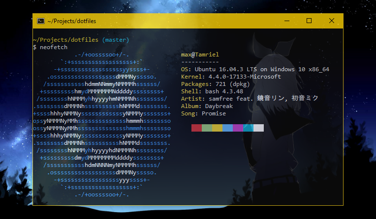

# dotfiles

My environment for Windows using [WSL](https://docs.microsoft.com/en-us/windows/wsl/about) (Ubuntu). Of particular interest may be:

- [.bashrc](home/.bashrc) which contains my aliases/functions as well as some shenanigans, notably:
  - [GG, a bash function for faster git committing](https://maxkagamine.com/blog/gg-a-bash-function-for-faster-git-committing)
  - [Nuke a git repo with unrelenting force: the FUS RO DAH command](https://maxkagamine.com/blog/nuke-a-git-repo-with-unrelenting-force)&nbsp;&nbsp;([日本語あり](https://maxkagamine.jp/blog/yuruginaki-chikara-de-git-no-henkou-o-kesu))
- [.gitconfig](home/.gitconfig)
- [git-branch-fzf](home/bin/git-branch-fzf), interactive git branch replacement using [fzf](https://github.com/junegunn/fzf) to search, preview, and switch branches
  - <kbd>Ctrl+A</kbd> toggles remote branches
  - <kbd>Ctrl+D</kbd> deletes the selected branch (including remotes and even the current branch, which is super helpful when switching back to master after merging a PR since you can mark it for deletion and switch in one go)
  - <kbd>Ctrl+L</kbd> checks out the latest of the selected branch by pulling it _before_ checkout, which avoids rolling back changes just to bring them back if the local branch is out of date (see [git-checkout-latest](home/bin/git-checkout-latest))
- [superman](home/bin/superman), a custom package manager manager for [syncing packages](home/.packages.conf)
- 🔑 For those who sign their commits, I have a pair of hooks for [post-commit](home/git-hooks/post-commit.d/post-commit-sign-sweetroll) and [post-rewrite](home/git-hooks/post-rewrite.d/post-rewrite-resign) that selectively sign only one's own commits, as Git will indiscriminately sign everything otherwise with [`commit.gpgSign`](https://git-scm.com/docs/git-config#git-config-commitgpgSign) set instead.
-  For Windows users, [shell-new-file.bat](home/bin/shell-new-file.bat) together with [this registry file](https://gist.github.com/maxkagamine/a9ddff58b7f2a780558f9ebd4315edbd) adds "New → Empty File", "New → package.json", "New → .gitignore (Visual Studio)", etc. to Explorer's context menu, taking advantage of a little-known [feature](http://mc-computing.com/WinExplorer/WinExplorerRegistry_ShellNew.htm) in the ShellNew key that allows arbitrary commands to be run.

Also part of my usual environment setup which may be of interest to Windows users: **[custom file icons](https://github.com/maxkagamine/CustomFileIcons)**.

[Wallpaper used in screenshot](https://i.imgur.com/sZDnISX.jpg)
