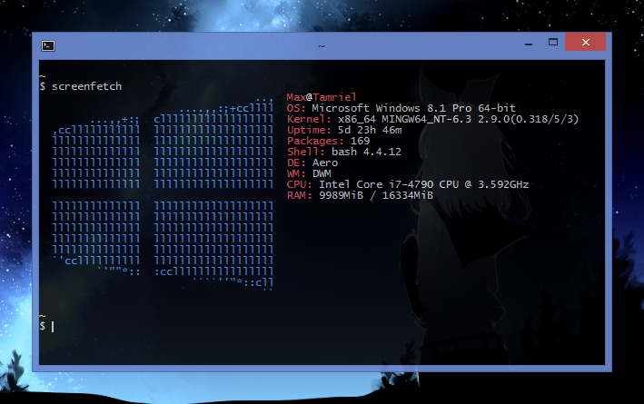

# dotfiles

  

My environment for Windows using [MSYS2](https://www.msys2.org).

Of particular interest may be:

- [setup script](setup/main.sh) which sets up symlinks, installs packages, and does some other environment configuration
- [.bashrc](home/.bashrc) which contains my aliases/functions as well as some shenanigans, notably:
  - [GG, a bash function for faster git committing](https://maxkagamine.com/blog/gg-a-bash-function-for-faster-git-committing)
  - The `fus ro dah!` command, powered by [sweetrolls](home/bin/sweetroll) (blog post soon)
- [.gitconfig](home/.gitconfig)
- [superman](home/bin/superman), a custom package manager manager for [syncing packages](home/.packages.conf)

Terminal appearance could use some improvement, and I expect to switch to [WSL](https://en.wikipedia.org/wiki/Windows_Subsystem_for_Linux) once my home computer is running Windows 10, now that Windows programs can be run from within the Linux environment.

For those who sign their commits, I have a [post-commit hook](home/git-hooks/post-commit.d/post-commit-unsign) that keeps git from signing other people's commits (for instance, during a rebase) with [`commit.gpgsign`](https://git-scm.com/docs/git-config#git-config-commitgpgSign) set since git will indiscriminately sign everything otherwise. If anyone knows a better solution, please let me know.

The `__new-*.bat` files in [bin](home/bin) are used by a set of registry tweaks, not included here, to add e.g. "New → package.json" and "New → .gitignore (Visual Studio)" to Explorer's context menu, taking advantage of a little-known [feature](http://mc-computing.com/WinExplorer/WinExplorerRegistry_ShellNew.htm) in the ShellNew key that allows arbitrary commands to be run.

Also part of my usual environment setup: **[custom file icons](https://github.com/maxkagamine/custom-file-icons)**.

[Wallpaper used in screenshot](https://i.imgur.com/sZDnISX.jpg)
